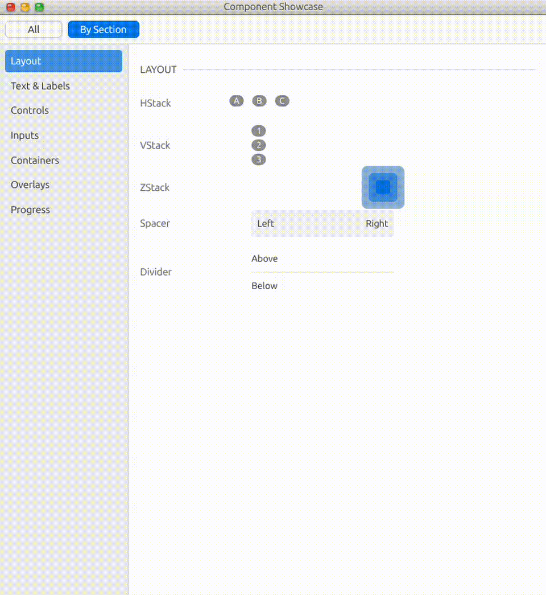

# AppLib

A native application framework for building Linux desktop applications.

> [!WARNING]
> **This project is experimental and in alpha.** I'm actively building and iterating on AppLib, so expect things to change—sometimes quickly. If you run into rough edges or missing features, know that I'm working on it. Things should improve rapidly as development continues.

> [!NOTE]
> **AI Disclaimer:** I use AI to help with some of my work on this project. I write some code myself, can still read and understand what code written by AI does, and I do review it.

AppLib provides the foundation for creating polished, high-performance desktop apps with a complete set of UI components, window management, and system integration.



## Features

- **60+ Components** - Buttons, lists, tables, forms, navigation, and more
- **Beautiful by Default** - Polished, cohesive design out of the box
- **Built on GPUI** - Leverages Zed's high-performance GPU-accelerated UI framework
- **Declarative API** - Intuitive, composable patterns for rapid development

## Quick Start

Add AppLib to your `Cargo.toml`:

```toml
[dependencies]
applib = "0.1"
gpui = "0.2"
```

Build your first UI:

```rust
use applib::prelude::*;

fn main() {
    App::new().run(|cx| {
        cx.open_window(WindowOptions::default(), |cx| {
            cx.new_view(|_cx| MyApp)
        });
    });
}

struct MyApp;

impl Render for MyApp {
    fn render(&mut self, cx: &mut ViewContext<Self>) -> impl IntoElement {
        WindowFrame::new(cx.view().clone())
            .child(
                VStack::new()
                    .gap_4()
                    .p_4()
                    .child(Text::new("Hello, AppLib!").size_xl().bold())
                    .child(
                        HStack::new()
                            .gap_2()
                            .child(Button::new("cancel", "Cancel"))
                            .child(Button::new("ok", "OK").primary())
                    )
            )
    }
}
```

## Available Components

### Layout
[`VStack`](https://applib.dev/docs/2_components/vstack) · [`HStack`](https://applib.dev/docs/2_components/hstack) · [`ZStack`](https://applib.dev/docs/2_components/zstack) · [`Spacer`](https://applib.dev/docs/2_components/spacer) · [`Divider`](https://applib.dev/docs/2_components/divider)

### Controls
[`Button`](https://applib.dev/docs/2_components/button) · [`IconButton`](https://applib.dev/docs/2_components/icon_button) · [`Toggle`](https://applib.dev/docs/2_components/toggle) · [`Checkbox`](https://applib.dev/docs/2_components/checkbox) · [`RadioGroup`](https://applib.dev/docs/2_components/radio_group) · [`Slider`](https://applib.dev/docs/2_components/slider) · [`Stepper`](https://applib.dev/docs/2_components/stepper) · [`Picker`](https://applib.dev/docs/2_components/picker) · [`DatePicker`](https://applib.dev/docs/2_components/date_picker) · [`ColorPicker`](https://applib.dev/docs/2_components/color_picker)

### Input
[`TextField`](https://applib.dev/docs/2_components/text_field) · [`SecureField`](https://applib.dev/docs/2_components/secure_field) · [`TextArea`](https://applib.dev/docs/2_components/text_area)

### Lists & Tables
[`List`](https://applib.dev/docs/2_components/list) · [`ListItem`](https://applib.dev/docs/2_components/list_item) · [`Table`](https://applib.dev/docs/2_components/table) · [`TableRow`](https://applib.dev/docs/2_components/table_row) · [`LazyVStack`](https://applib.dev/docs/2_components/lazy_vstack) · [`LazyHStack`](https://applib.dev/docs/2_components/lazy_hstack) · [`LazyVGrid`](https://applib.dev/docs/2_components/lazy_vgrid) · [`LazyHGrid`](https://applib.dev/docs/2_components/lazy_hgrid)

### Navigation
[`TabView`](https://applib.dev/docs/2_components/tab_view) · [`Sidebar`](https://applib.dev/docs/2_components/sidebar) · [`SidebarItem`](https://applib.dev/docs/2_components/sidebar_item) · [`Menu`](https://applib.dev/docs/2_components/menu) · [`ContextMenu`](https://applib.dev/docs/2_components/context_menu)

### Windows & Containers
[`WindowFrame`](https://applib.dev/docs/2_components/window_frame) · [`TitleBar`](https://applib.dev/docs/2_components/title_bar) · [`TrafficLights`](https://applib.dev/docs/2_components/traffic_lights) · [`SplitView`](https://applib.dev/docs/2_components/split_view) · [`ScrollView`](https://applib.dev/docs/2_components/scroll_view) · [`Panel`](https://applib.dev/docs/2_components/panel) · [`Sheet`](https://applib.dev/docs/2_components/sheet) · [`Alert`](https://applib.dev/docs/2_components/alert) · [`Popover`](https://applib.dev/docs/2_components/popover) · [`GroupBox`](https://applib.dev/docs/2_components/group_box) · [`Section`](https://applib.dev/docs/2_components/section) · [`Form`](https://applib.dev/docs/2_components/form) · [`DisclosureGroup`](https://applib.dev/docs/2_components/disclosure_group)

### Display
[`Text`](https://applib.dev/docs/2_components/text) · [`Label`](https://applib.dev/docs/2_components/label) · [`Badge`](https://applib.dev/docs/2_components/badge) · [`Image`](https://applib.dev/docs/2_components/image) · [`ProgressView`](https://applib.dev/docs/2_components/progress_view) · [`EmptyState`](https://applib.dev/docs/2_components/empty_state) · [`EmptyView`](https://applib.dev/docs/2_components/empty_view) · [`Canvas`](https://applib.dev/docs/2_components/canvas) · [`ColorView`](https://applib.dev/docs/2_components/color_view) · [`Link`](https://applib.dev/docs/2_components/link) · [`Tooltip`](https://applib.dev/docs/2_components/tooltip)

## Documentation

- [Online Documentation](https://applib.dev/docs)
- [API Reference](https://docs.rs/applib)
- [Examples](https://github.com/cihantas/applib/tree/main/examples)

## License

AppLib is dual-licensed:

### Open Source (Free)

**LGPL-3.0-or-later with Additional Terms**

- ✅ Build any application (commercial or open source)
- ✅ Sell your applications
- ✅ Keep your application code proprietary
- ✅ Create plugins, themes, and extensions
- 📤 Share modifications to AppLib itself (LGPL requirement)
- ❌ Cannot create competing UI frameworks

See [LICENSE](LICENSE) for complete terms.

### Commercial License

For organizations that prefer:
- Not sharing modifications to AppLib
- Enterprise support and SLAs
- Additional features and priority fixes
- Indemnification and warranties

Contact: cihan@tas.fm

## Contributing

Contributions are welcome. Please read the [Contributor License Agreement](CLA.md) before submitting pull requests.

```bash
# Clone the repository
git clone https://github.com/cihantas/applib.git

# Build
cargo build

# Run tests
cargo test

# Generate documentation
cargo doc --open
```

## Community

- [GitHub Discussions](https://github.com/cihantas/applib/discussions)
